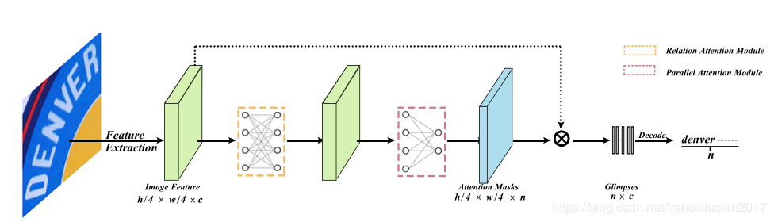

# 2D Attentional Irregular Scene Text Recognizer

Unofficial PyTorch implementation of the [paper](https://arxiv.org/pdf/1906.05708.pdf), which transforms the irregular text with 2D layout to character sequence directly via 2D attentional scheme. They utilize a relation attention module to capture the dependencies of feature maps
and a parallel attention module to decode all characters in
parallel.

At present, the accuracy of the paper cannot be achieved. And i borrowed code from [deep-text-recognition-benchmark](https://github.com/clovaai/deep-text-recognition-benchmark)

**model**
 

**Feature**
1. Output image string once not like the seqtoseq model

---
## Requirements
Pytorch >= 1.1.0


## Test
1. download the pretrained model [Baidu](https://pan.baidu.com/s/1tcYPOzxk3_91YalKyYIwug) *password:* 6ovu

2. test on images which in demo_image folder
```bash
python demo.py --image_folder demo_image --saved_model <model_path/best_accuracy.pth>
```

---

## Train
1. I prepared a small dataset for train.The image and labels are in `./dataset/BAIDU`.
```bash
python train.py --select_data baidu  --root train_images --train_csv train.txt --val_csv valid.txt --Transformation TPS --rgb --rotate --uncertainly_loss True
```

## Txt reference
image_name,gt  
image_name,gt  
......  
image_name,gt


## Reference
1. [deep-text-recognition-benchmark](https://github.com/clovaai/deep-text-recognition-benchmark)
2. [2D Attentional Irregular Scene Text Recognizer](https://arxiv.org/pdf/1906.05708.pdf)
